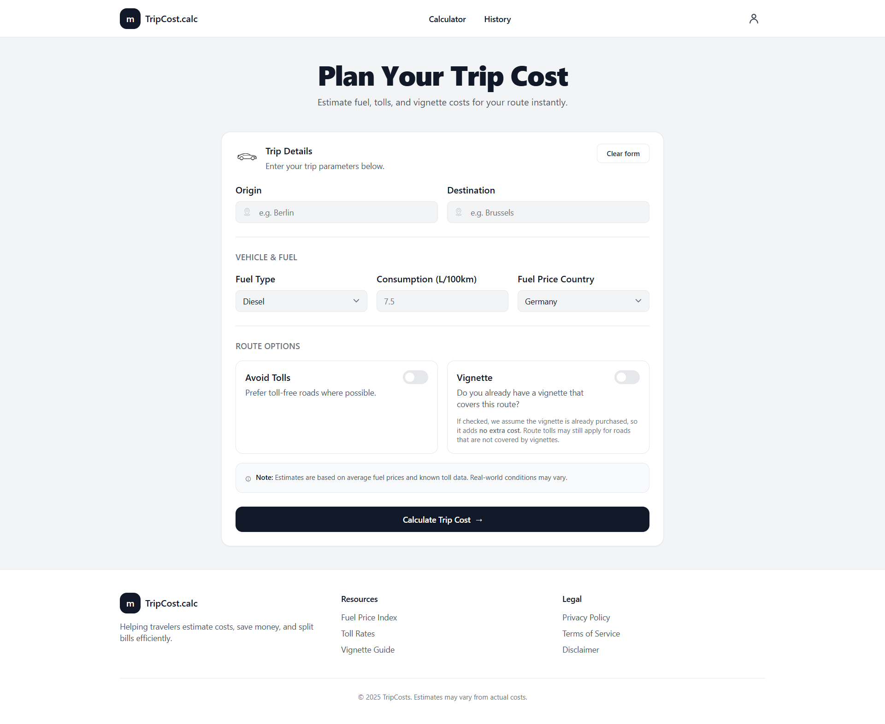
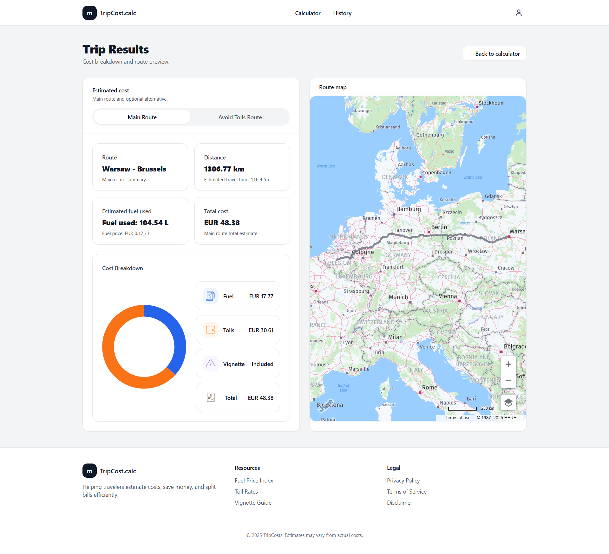
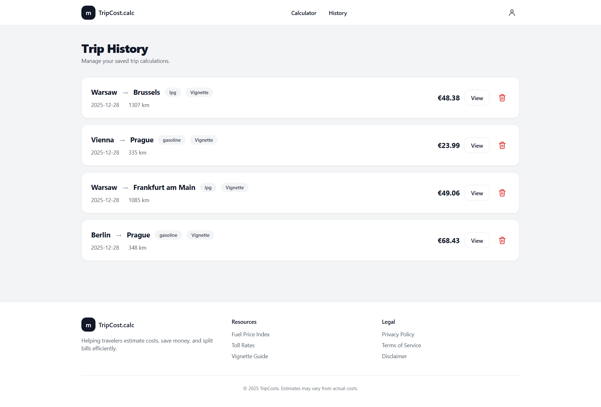

# Trip Cost Calculator

A lightweight web application that estimates the total cost of a car trip based on distance, fuel consumption, fuel prices, tolls, and optional toll avoidance.

The project is designed as a portfolio piece and as a practical tool for estimating personal car trip expenses (for example, Berlin → Brussels).

---

## Live Demo

The application is deployed and available at:  
https://trip-cost-calculator-production.up.railway.app/calculator


## Features

- User authentication (registration, login, logout)
- Trip cost calculation between two locations
- Fuel cost calculation based on:
  - vehicle fuel consumption (L/100 km)
  - fuel prices stored in the database
- Toll cost calculation using external routing data
- Optional toll avoidance route
- Cost comparison between main route and alternative route
- Interactive map visualization of routes
- Trip history stored per authenticated user

## How It Works

1. User enters origin, destination, fuel type, and vehicle consumption.
2. The backend requests route data from HERE Routing API.
3. Fuel cost is calculated using distance and fuel prices from the database.
4. Toll costs are calculated from routing response.
5. An optional toll-free route is calculated for comparison.
6. Results and route geometry are displayed on an interactive map.
7. Trip data is stored in user history (authenticated users only).

## Screenshots

### Trip Calculator


### Trip Results


### Trip History


---
## Tech Stack

- Backend: PHP 8+, Laravel
- Frontend: Laravel Blade, Tailwind CSS, Vite
- Database: PostgreSQL
- Routing and toll data: HERE Routing API
- Maps: HERE Maps JavaScript API
- Authentication: Laravel Breeze

---

## Fuel Price Data

Fuel prices are stored in the application database.

The database was populated using publicly available fuel price datasets (e.g. Trading Economics).  
The database itself is not included in the repository. Only the database schema (migrations) and application logic are tracked in Git.

---

## Requirements

- PHP 8.2+
- Composer
- Node.js and npm
- PostgreSQL
- HERE API key

---

## Local Setup

1. Clone the repository:

```bash
git clone https://github.com/your-username/trip-cost-calculator.git
cd trip-cost-calculator
```
2. Install backend dependencies:
```
composer install
```
3. Install frontend dependencies and build assets:
```
npm install
npm run build
```
4. Environment configuration:
```
cp .env.example .env
php artisan key:generate
```
Edit the .env file and configure:

* Database connection (DB_HOST, DB_PORT, DB_DATABASE, DB_USERNAME, DB_PASSWORD)

* HERE API key (HERE_API_KEY)

5. Run database migrations:
```
php artisan migrate
```
6. Start the development server:
```
php artisan serve
```
The application will be available at:
```
http://localhost:8000

```
## Environment Variables

- `HERE_API_KEY` – HERE Maps and Routing API key
- `DB_CONNECTION` – Database driver (PostgreSQL)
- `DB_HOST` – Database host
- `DB_PORT` – Database port
- `DB_DATABASE` – Database name
- `DB_USERNAME` – Database user
- `DB_PASSWORD` – Database password
- `APP_ENV` – Application environment
- `APP_DEBUG` – Debug mode (should be disabled in production)

---

## Deployment

The application can be deployed to platforms such as **Railway**, **Render**, or similar services.

Typical deployment steps:

- Connect the GitHub repository to the hosting platform
- Configure environment variables on the platform
- Set `APP_ENV=production` and `APP_DEBUG=false`
- Run database migrations during deployment
- Build frontend assets using Vite

---

## Notes

- Fuel prices are retrieved from the database at runtime.
- API keys and sensitive credentials are not stored in the repository.
- The project focuses on MVP functionality and clean, readable code.

---

## License

This project is intended for portfolio purposes.


